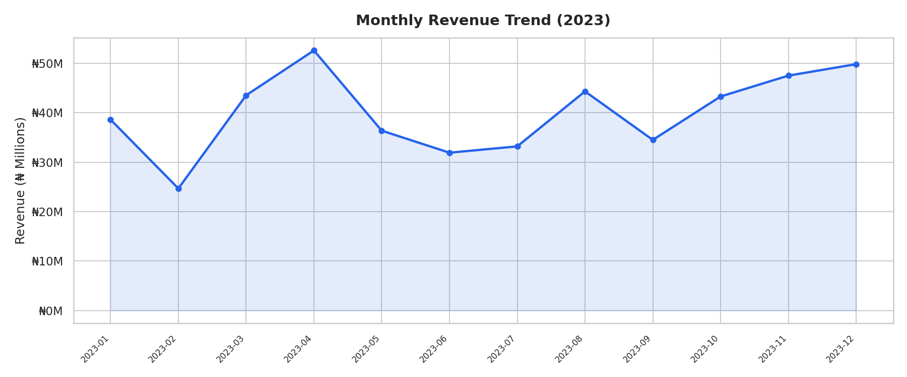
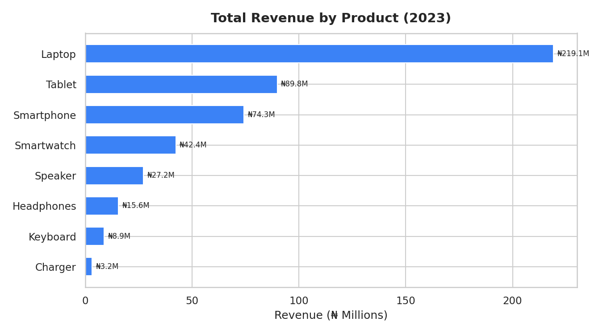
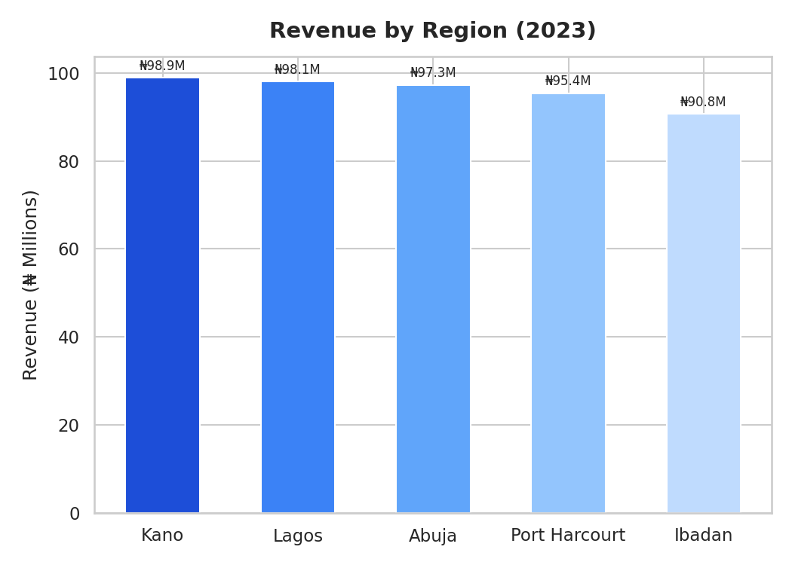
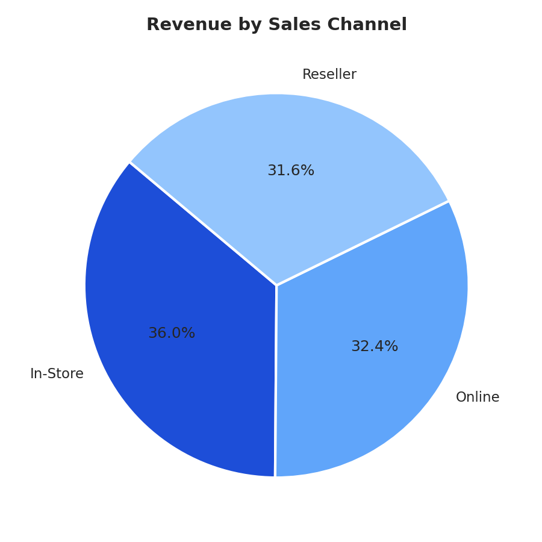
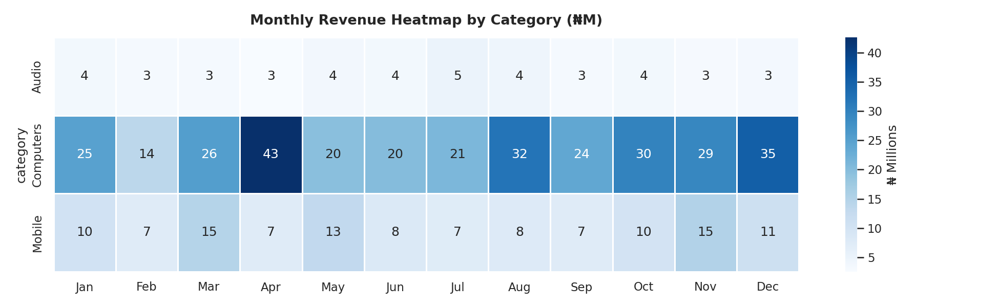

# 📊 Sales Performance Analysis (2023)

Exploratory data analysis of a retail electronics business across 5 Nigerian cities — revenue trends, top products, regional breakdowns, and sales channel performance.

## 🔍 What This Covers
- Monthly revenue trends across the full year
- Best and worst performing products by total revenue
- Regional sales comparison (Lagos, Abuja, Kano, Port Harcourt, Ibadan)
- Sales channel breakdown (Online vs In-Store vs Reseller)
- Category performance heatmap by month

## 📌 Key Insights
| Metric | Result |
|---|---|
| Total Revenue (2023) | ₦480M+ |
| Best Month | April 2023 |
| Top Product | Laptop |
| Top Region | Kano |
| Top Channel | In-Store |
| Avg Order Value | ₦400,413 |
| Total Orders | 1,200 |

- Laptops and Smartphones dominate revenue despite lower order volume — high unit price products drive total sales
- In-Store slightly outperforms Online, showing strong walk-in behaviour
- Audio products show consistent monthly demand — a steady category worth investing in

## 🛠 Tools
Python — pandas, matplotlib, seaborn

## ▶️ How to Run
```bash
pip install pandas matplotlib seaborn
python analysis.py
```

## 📈 Charts





