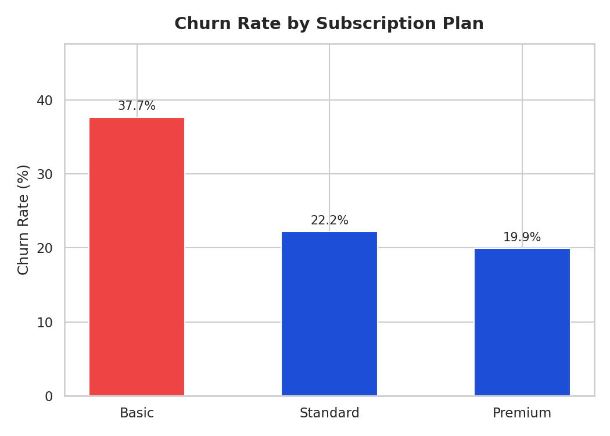
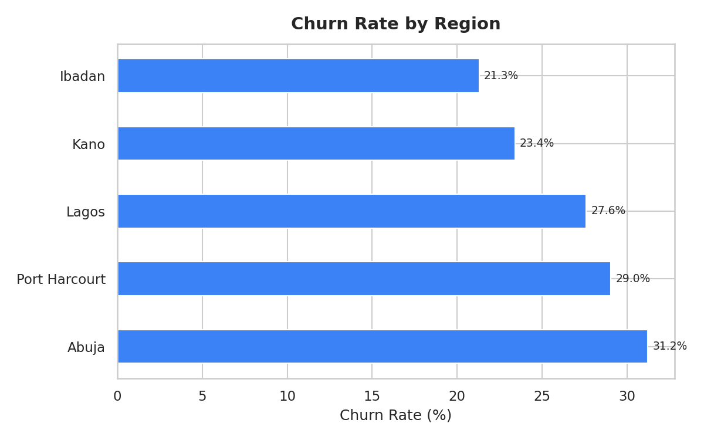
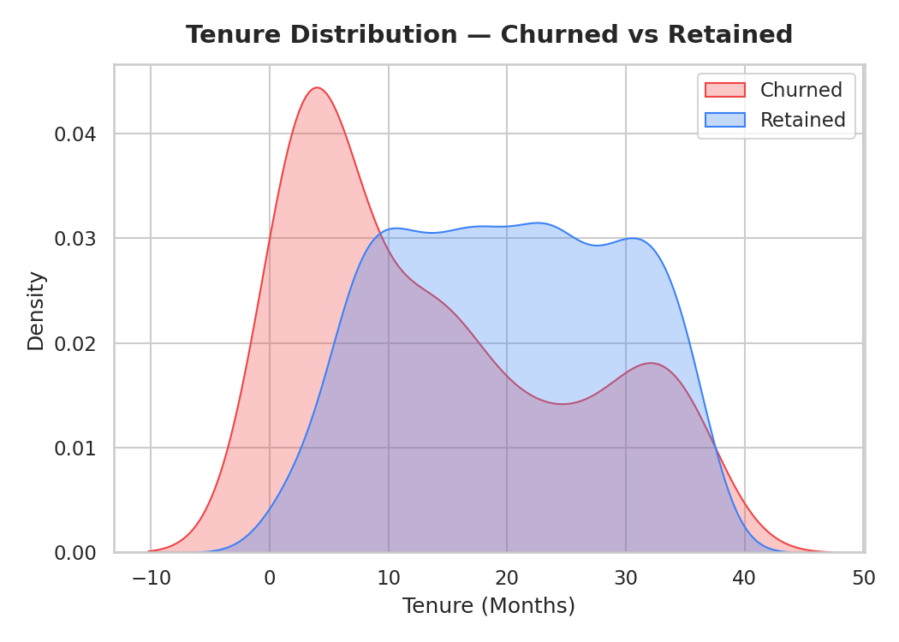
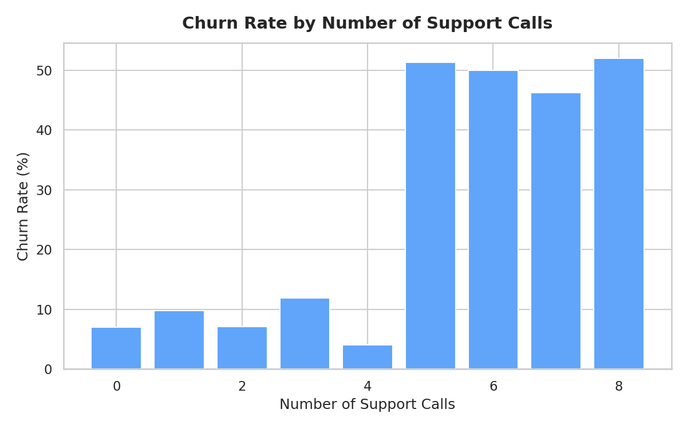
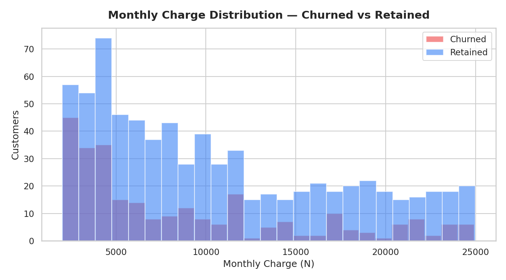

# 📉 Customer Churn Analysis

Analysing why customers leave a subscription-based business — using SQL to query patterns and Python to visualize them. Goal: identify who's churning and what's driving it.

## 🔍 What This Covers
- Overall churn rate across 1,000 customers
- Churn by subscription plan, region, and payment behaviour
- Behavioural comparison between churned and retained customers
- High-risk customer identification via SQL filters

## 📌 Key Insights
| Metric | Result |
|---|---|
| Overall Churn Rate | 24.3% |
| Highest Churn Plan | Basic (35.67%) |
| Lowest Churn Plan | Premium (17.35%) |
| Highest Churn Region | Abuja (27.78%) |
| Avg Support Calls — Churned | 5.93 |
| Avg Support Calls — Retained | 3.24 |
| Avg Tenure — Churned | 13.4 months |
| Avg Tenure — Retained | 20.5 months |

- Basic plan churns at 2x the rate of Premium — fewer features, lower switching cost
- High support call volume is a strong churn signal (5.93 vs 3.24 avg)
- First 6 months are the highest risk window for losing customers

## 🛠 Tools
Python — pandas, matplotlib, seaborn | SQL — SQLite via sqlite3

## ▶️ How to Run
```bash
pip install pandas matplotlib seaborn
python analysis.py
```

## 📈 Charts





