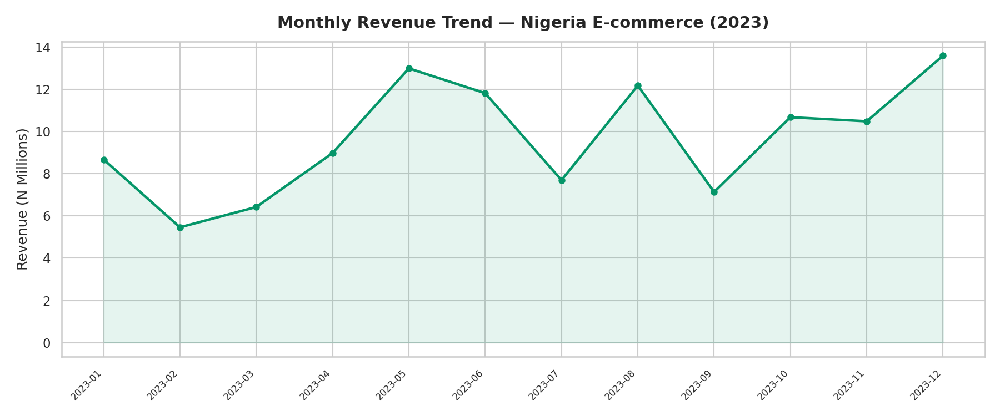
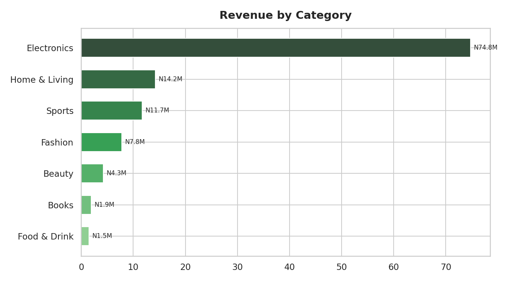
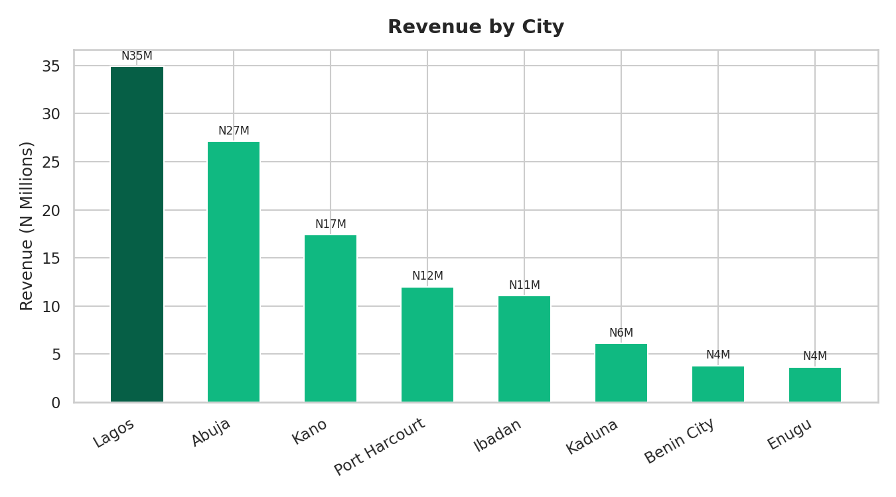
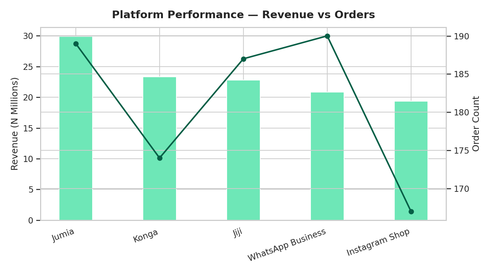
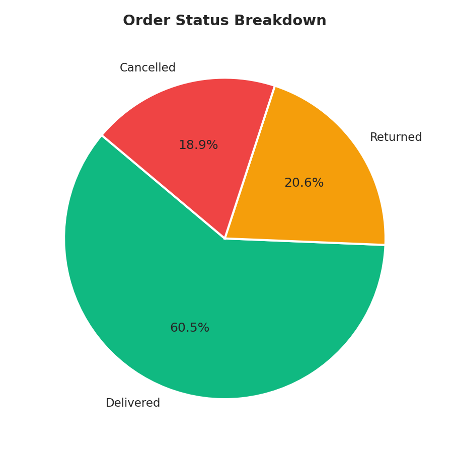
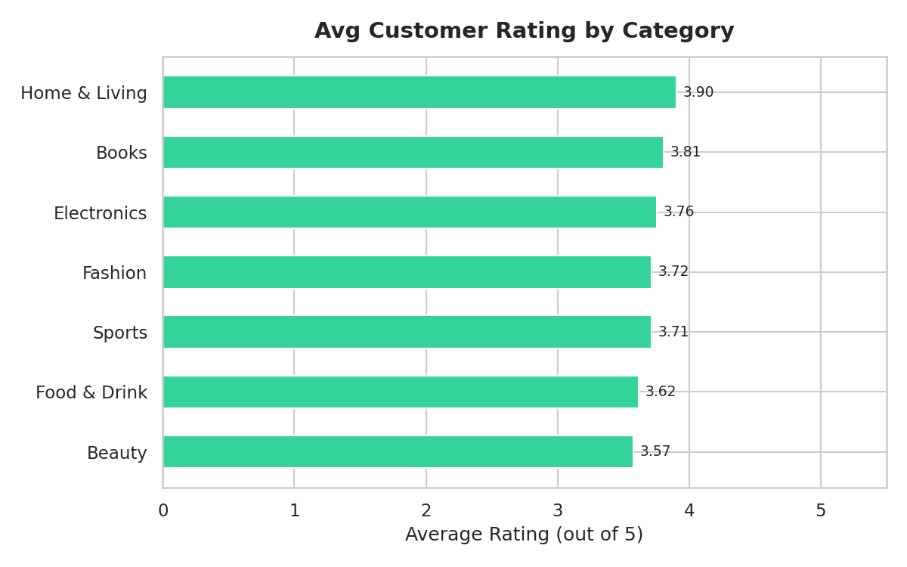

# 🛒 Nigeria E-Commerce Dashboard (2023)

End-to-end analysis of a Nigerian e-commerce business — revenue trends, top categories, city-level performance, platform comparisons, delivery metrics, and customer ratings. Includes Power BI-ready CSV exports.

## 🔍 What This Covers
- Monthly revenue trends across 2023
- Category revenue and average customer ratings
- City-level breakdown across 8 Nigerian cities
- Platform comparison (Jumia, Konga, Jiji, Instagram Shop, WhatsApp Business)
- Order status breakdown (Delivered / Returned / Cancelled)
- Power BI / Tableau ready exports

## 📌 Key Insights
| Metric | Result |
|---|---|
| Total Orders | 1,500 |
| Delivery Rate | 60.9% |
| Return Rate | 20.3% |
| Cancellation Rate | 18.8% |
| Avg Customer Rating | 3.75 / 5.0 |
| Avg Delivery Time | 5.6 days |

- Electronics drives highest revenue due to high unit prices
- Lagos leads revenue — Abuja follows closely
- Instagram Shop and WhatsApp Business punch above their weight, reflecting Nigeria's social commerce growth
- 39.1% return + cancel rate is a common Nigerian e-commerce challenge — trust and logistics gaps

## 🛠 Tools
Python — pandas, matplotlib, seaborn | Power BI / Tableau (via CSV exports)

## ▶️ How to Run
```bash
pip install pandas matplotlib seaborn
python analysis.py
```
Power BI users: connect directly to the `/exports/` folder.

## 📈 Charts






